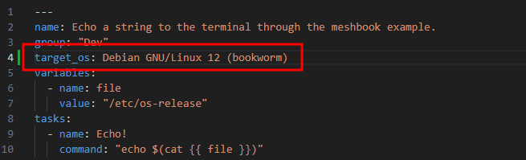

> [!NOTE]
> *If you experience issues or have suggestions, submit an issue! https://github.com/DaanSelen/meshbook/issues I'll respond ASAP!*

# Meshbook

A way to programmatically manage MeshCentral-managed machines, inspired by applications like [Ansible](https://github.com/ansible/ansible).<br>
What problem does it solve? Well, what I wanted to be able to do is to automate system updates through [MeshCentral](https://github.com/ylianst/meshcentral). And some machines are behind unmanaged or 3rd party managed firewalls.<br>
And many people will be comfortable with YAML configurations! It's almost like JSON, but different!<br>

# Quick-start:

The quickest way to start is to grab a template from the templates folder in this repository.<br>
Make sure to correctly pass the MeshCentral websocket API as `wss://<MeshCentral-Host>`.<br>
And make sure to fill in the credentails of an account which has `Remote Commands`, `Details` and `Agent Console` permissions on the targeted devices or groups.<br>

> I did this through a "Service account" with rights on the device group.

Then make a yaml with a target and some commands! See below examples as a guideline. And do not forget to look at the bottom's notice.<br>
To install, follow the following commands:<br>

### Linux setup:

```shell
git clone https://github.com/daanselen/meshbook
cd ./meshbook
python3 -m venv ./venv
source ./venv/bin/activate
pip3 install -r ./requirements.txt
```

### Windows setup:

```shell
git clone https://github.com/daanselen/meshbook
cd ./meshbook
python3 -m venv ./venv
.\venv\Scripts\activate # Make sure to check the terminal prefix.
pip3 install -r ./requirements.txt
```

Now copy the configuration template from ./templates and fill it in with the correct details. The url should start with `wss://`.<br>
After this you can use meshbook, for example:

### Linux run:

```shell
python3 .\meshbook.py -pb .\examples\echo.yaml
```

### Windows run:

```shell
.\venv\Scripts\python.exe .\meshbook.py -pb .\examples\echo.yaml
```

### How to check if everything is okay?

The python virtual environment can get messed up, therefore...<br>
To check if everything is in working order, make sure that the lists from the following commands are aligned:

```
python3 -m pip list
pip3 list
```

If not, perhaps you are using the wrong executable, the wrong environment and so on...

# How to create a configuration?

This paragraph explains how the program interprets certain information.

### Targeting:

MeshCentral has `meshes` or `groups`, in this program they are called `group(s)`. Because of the way I designed this.<br>
So to target for example a mesh/group in MeshCentral called: "Nerthus" do:

> If your group has multiple words, then you need to use `"` to group the words.

```yaml
---
name: example configuration
group: "Nerthus"
variables:
  - name: var1
    value: "This is the first variable"
tasks:
  - name: echo the first variable!
    command: 'echo "{{ var1 }}"'
```

It is also possible to target a single device, as seen in: [here](./examples/apt_update_example.yaml).<br>

### Variables:

Variables are done by replacing the placeholders just before the runtime (the Python program does this, not you).<br>
So if you have var1 declared, then the value of that declaration is placed wherever it finds {{ var1 }}.<br>
This is done to imitate popular methods. See below [from the example](./examples/variable_usage_example.yaml).<br>

### Tasks:

The tasks you want to run should be contained under the `tasks:` with two fields, `name` and `command`.<br>
The name field is for the user of meshbook, to clarify what the following command does in a summary.<br>
The command field actually gets executed on the end-point.<br>

### Granual Operating System control:

I have made the program so it can have a basic filter with the Operating systems. If you have a mixed group, then you need to match the image below like this:

<br>


This will filter the nodes/machines in the MeshCentral group to the ones matching this. Very basic and open for feedback. This must match the full string, not case sensitive.

# Example:

For the example, I used the following yaml file (you can find more in [this directory](./examples/)):

The below group: `Dev` has three devices, of which one is offline, Meshbook checks if the device is reachable.<br>
You can expand the command chain as follows:<br>

```yaml
---
name: Echo a string to the terminal through the meshbook example.
group: "Dev"
variables:
  - name: file
    value: "/etc/os-release"
tasks:
  - name: Echo!
    command: "echo $(cat {{ file }})"
```

The following response it received when executing the first yaml of the above files (without the `-s` parameters, which just outputs the below JSON).

```shell
python3 meshbook.py -pb examples/echo_example.yaml
----------------------------------------
Trying to load the MeshCentral account credential file...
Trying to load the Playbook yaml file and compile it into something workable...
Connecting to MeshCentral and establish a session using variables from previous credential file.
Generating group list with nodes and reference the targets from that.
----------------------------------------
Executing playbook on the targets.
1. Running: Echo!
----------------------------------------
{
    "Task 1": [
        {
            "complete": true,
            "result": "PRETTY_NAME=\"Debian GNU/Linux 12 (bookworm)\" NAME=\"Debian GNU/Linux\" VERSION_ID=\"12\" VERSION=\"12 (bookworm)\" VERSION_CODENAME=bookworm ID=debian HOME_URL=\"https://www.debian.org/\" SUPPORT_URL=\"https://www.debian.org/support\" BUG_REPORT_URL=\"https://bugs.debian.org/\"\n",
            "command": "echo $(cat /etc/os-release)",
            "device_id": "<Node-Unique>",
            "device_name": "raspberrypi5"
        },
        {
            "complete": true,
            "result": "PRETTY_NAME=\"Debian GNU/Linux 12 (bookworm)\" NAME=\"Debian GNU/Linux\" VERSION_ID=\"12\" VERSION=\"12 (bookworm)\" VERSION_CODENAME=bookworm ID=debian HOME_URL=\"https://www.debian.org/\" SUPPORT_URL=\"https://www.debian.org/support\" BUG_REPORT_URL=\"https://bugs.debian.org/\"\n",
            "command": "echo $(cat /etc/os-release)",
            "device_id": "<Node-Unique>",
            "device_name": "Cubic"
        }
    ]
}
```
The above without `-s` is quite verbose. use `--help` to read about parameters and getting a minimal response for example.

# Important Notice:

If you want to use this, make sure to use `NON-BLOCKING` commands. MeshCentral does not work if you send it commands that wait.<br>
A couple examples of `BLOCKING COMMANDS` which will never get back to the main MeshCentral server, and Meshbook will quit after the timeout but the agent will not come back:

```shell
apt upgrade # without -y.

sleep infinity

ping 1.1.1.1 # without a -c flag (because it pings forever).
```
